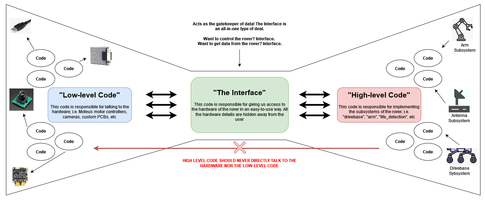
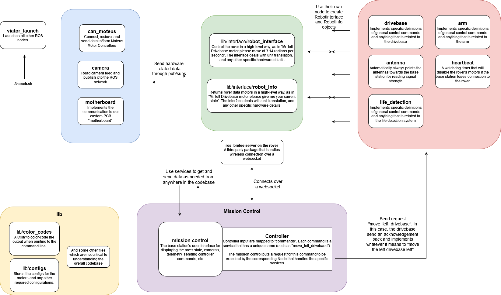
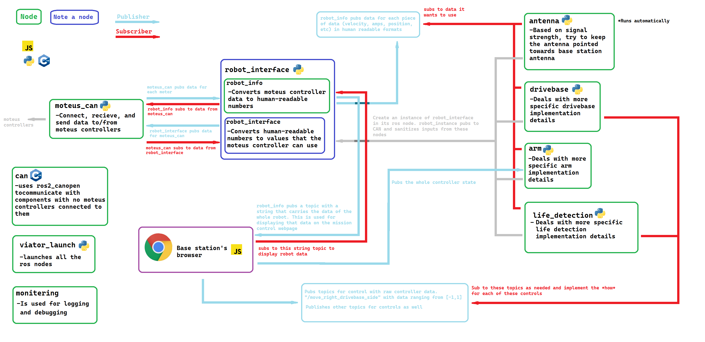

# Code Overview

## Introduction
Most of the codebase is written in Python as the language is easier to develop in and has more third-party libraries compared to C++. However, that does
not mean that C++ cannot be used - it depends on the needs. The code uses Docker in order to standardize the working environment in which code runs,
this making it easier for you to develop and deploy code on the rover. 

The code is split into two Github repositories: urc-2023 and mission-control. Keep in mind that the mission control breaks the code design a little as
it is not running on the rover computer but rather over the network on your laptop! The mission control should never represent the state of the rover. 

## The Core Idea

The code is split into three parts:

1. **Low-level code** -> This deals with the funky hardware communication such as USB, CAN bus, Wi-Fi, etc. It prepares publishers/subscribers for the interface to use

2. **The interface** -> This deals making it easy to interact with the rover by exposing functions such as `runMotor()` or `getMotorState()`

3. **High-level code** -> This implements the subsystems found on the rover. It directly talks to the interface in order to get the rover to physicall do things. 
Notice how the high-level code does not care about the hardware, thus making it easier to focus on the **algorithms** rather than fighting the hardware.

## Mission Control
The mission control is a piece of software that allows us to intereact with the rover over a browser as it is written in Vue.js/Typescript. 
Cameras, controller input, telemetry data, controlling motors, life-detection results, and so on are all shown here. 

A very important concept is that the mission control acts as a **CLIENT** when sending and getting data from the rover. This means that the mission control
should never represent the current state of the rover; i.e. you cannot represent what mode the arm is in (individual motor control, disabled, inverse kinematics, etc)
in the mission control 

One very good thing about the mission control is that it has access to the ROS network, which allows us to use subscribers, publishers, and services. All data that 
is sent between the rover and the mission control are ROS services. The mission control requests and the rover responds. Using services will also allow us to
determine if data was dropped while transmitting across the Utah desert. 

## Quick Description of the Packages
### arm ("high-level")
Implements the arm in different control types such as individual motor control (via velocity or position), inverse kinematics, and so on. 
### can_moteus ("low-level")
Interacts with the Moteus Field Oriented BLDC motor controllers. This code is able to update the motor controller configs, send data to the motor, read data from the motor,
and handle CAN-FD bus issues. 
### custom_interfaces (misc)
This code is used to create custom publisher/subsriber and service payloads. 
### lib (misc and "the interface")
Contains commonly used functionality throughout the codebase. This is the home to "the interface" code as well under the folder `\interface`
### viator_launch (misc)
This code launches all ROS nodes found in our codebase. It is analogous to the `main()` entry point functions in most programming languages. 

## Putting It All Together

<!-- # **Code Overview**

Most of the codebase is written in Pyton as Python is easier to develop in and has more third-party libraries compared to C++. Most of our components depend on the `robot_interface` class to control the robot. 

## **Diagram**

## **Components of the CodeBase**
### **CAN Related**

### **`can_moteus`**
[Docs link](./can_moteus.md)

This is a **ROS Node** that is responsible for communication between the [**Moteus motor controllers**](https://github.com/mjbots/moteus) (via a FDCAN/CAN Bus) and **ROS** that the rest of the codebase is written in.

### **`robot_interface`**
This is responsible for converting human units into Moteus units that the Moteus controllers can understand. This is **not** a ROS Node, and instead will be an object that **takes in** a ROS Node to subscribe to data published by `can_moteus`. There are a long list of methods that correspond to the functionality of the rover; i.e. `setBottomArmMotorAngle(123)` would set the angle of the bottom motor of the arm to 123 degrees.

### **Robot Functionality**

### **`antenna`**
This is responsible for always pointing the robot antenna towards the base station's antenna to secure the strongest WiFi signal.

### **`drivebase`**
This is responsible for implementing *how* a drivebase should work depending on user input.

Through a subscriber, it will recieve signals to when execute a high level control scheme: "move left side", "move right side", "move forwards", etc.

### **`arm`**
This is responsible for controlling the arm via high level control schemes using inverse-kinematics.

### **`life_detection`**
This detects life somehow. The physical design is still in progress

### **Base Station**
### **`mission_control`**
This will host a webpage through sockets utilizing rosbridge to expose ROS-like behavior. The webpage will display information about the rover in addition to video output. The webpage will also sent controller input to the ROS network.

### **Miscellaneous**

### **`viator_launch`**
This launches all of the ROS nodes in our code. If you want to add a node, make sure to update the [`robot.launch.py`](../src/viator_launch/launch/robot.launch.py) and the [`package.xml`](../src/viator_launch/setup.py) files.

### **`can`**
This is responsible for using the CANOpen protocol using the [ros2_canopen](https://github.com/ros-industrial/ros2_canopen) library to communicate between a few parts of the rover which cannot use the moteus controllers.

### **`monitering`**
This is planned to be utilized as a logging system. This might or might not be removed

 -->
